<!-- Generated by scripts/build.py from scripts/content.py. Edit those, not this file. -->

  

<picture><source media="(prefers-color-scheme: dark)" srcset="./assets/header-whoami-dark.svg"></picture>

<picture><source media="(prefers-color-scheme: dark)" srcset="./assets/lily-dark.svg"></picture> <picture><source media="(prefers-color-scheme: dark)" srcset="./assets/whoami-dark.svg"></picture>

  

<picture><source media="(prefers-color-scheme: dark)" srcset="./assets/header-work-dark.svg"></picture>

<a href="https://zentinel.onrender.com"><picture><source media="(prefers-color-scheme: dark)" srcset="./assets/project-zentinel-dark.svg"></picture></a> <a href="https://github.com/Kruthik481/razorpay-recon-agent"><picture><source media="(prefers-color-scheme: dark)" srcset="./assets/project-recon-dark.svg"></picture></a>

<a href="https://stacksense-eight.vercel.app"><picture><source media="(prefers-color-scheme: dark)" srcset="./assets/project-stacksense-dark.svg"></picture></a> <a href="https://alpha-forge-vert.vercel.app"><picture><source media="(prefers-color-scheme: dark)" srcset="./assets/project-alphaforge-dark.svg"></picture></a>

Source: <a href="https://github.com/Kruthik481/zentinel">Zentinel</a> · <a href="https://github.com/Kruthik481/razorpay-recon-agent">Reconciliation Agent</a> · <a href="https://github.com/Kruthik481/stacksense">StackSense</a> · <a href="https://github.com/Kruthik481/AlphaForge">AlphaForge</a>

  

<picture><source media="(prefers-color-scheme: dark)" srcset="./assets/header-principles-dark.svg"></picture>

<picture><source media="(prefers-color-scheme: dark)" srcset="./assets/principles-dark.svg"></picture>

  

<picture><source media="(prefers-color-scheme: dark)" srcset="./assets/header-activity-dark.svg"></picture>

<picture><source media="(prefers-color-scheme: dark)" srcset="https://raw.githubusercontent.com/Kruthik481/Kruthik481/output/snake-dark.svg"></picture>

  

<picture><source media="(prefers-color-scheme: dark)" srcset="./assets/header-contact-dark.svg"></picture>

<a href="https://kruthik-n.vercel.app"><picture><source media="(prefers-color-scheme: dark)" srcset="./assets/link-portfolio-dark.svg"></picture></a> <a href="https://www.linkedin.com/in/kruthik-n-8a22b62a5"><picture><source media="(prefers-color-scheme: dark)" srcset="./assets/link-linkedin-dark.svg"></picture></a> <a href="mailto:kruthikn05@gmail.com"><picture><source media="(prefers-color-scheme: dark)" srcset="./assets/link-email-dark.svg"></picture></a> <a href="https://x.com/OcraKruthik"><picture><source media="(prefers-color-scheme: dark)" srcset="./assets/link-x-dark.svg"></picture></a>

